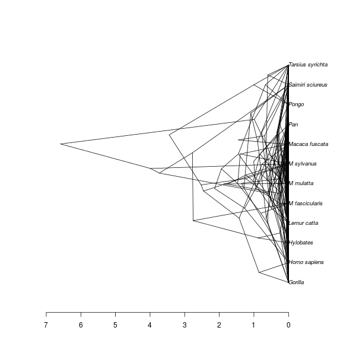

# babette_example_9

Branch   |[](https://travis-ci.org)                                                                                           |[](https://appveyor.com)                                                                                               
---------|--------------------------------------------------------------------------------------------------------------------------------------------------------|--------------------------------------------------------------------------------------------------------------------------------------------------------------------------------------------
`master` |[](https://travis-ci.org/richelbilderbeek/babette_example_9) |[](https://ci.appveyor.com/project/richelbilderbeek/babette-example-9/branch/master)
`develop`|[](https://travis-ci.org/richelbilderbeek/babette_example_9)|[](https://ci.appveyor.com/project/richelbilderbeek/babette-example-9/branch/develop)

A [babette example](https://github.com/richelbilderbeek/babette_examples).

## Example #9: sampling from prior 

Using all default settings, only check 'Sample from prior'

```
BEAUti picture with 'Sample from prior' checked
```

```
# Code here
```

All other parameters are set to their defaults, as in BEAUti.

## Result


